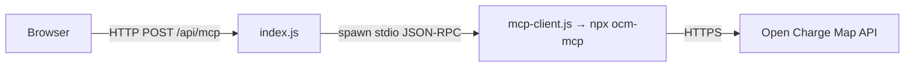

# MCP Contract (as used by this demo)

This demo talks to the [`ocm-mcp`](https://github.com/andreibesleaga/ocm-sdk) server over
stdio using JSON-RPC 2.0. Only a small slice of the server's surface is used.

## Architecture



## HTTP surface (this app)

| Method | Path | Body | Response |
|---|---|---|---|
| `POST` | `/api/mcp` | `{ "command": "<natural language>" }` | POI array, `{ tools: [...] }`, or `{ error, availableCommands }` |
| `GET` | `/healthz` | – | `{ "ok": true }` |
| `GET` | `/` | – | static web UI |

`command` must be a non-empty string, else `400 { error }`.

## MCP tool calls used

- `tools/list` → list available tools.
- `tools/call` with `name: "list_poi"` and arguments:

```jsonc
{
  "latitude":  51.5074,   // number
  "longitude": -0.1278,   // number
  "distance":  25,        // km radius
  "maxresults": 100,      // cap
  "countrycode": "GB"     // optional ISO-3166 alpha-2
}
```

`list_poi` returns OCM POI objects; each has an `AddressInfo` with `Latitude`/`Longitude`
used for client-side distance filtering. The MCP response wraps the payload as
`result.content[0].text` (JSON string), which `mcp-client.js` parses.
